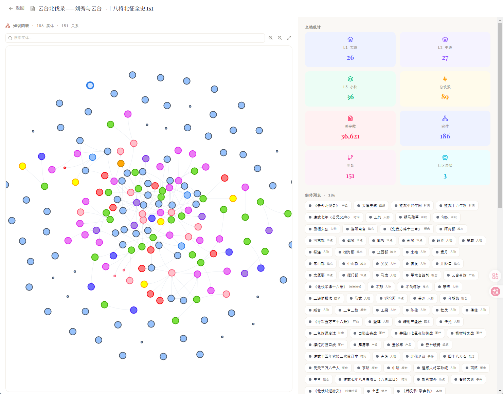
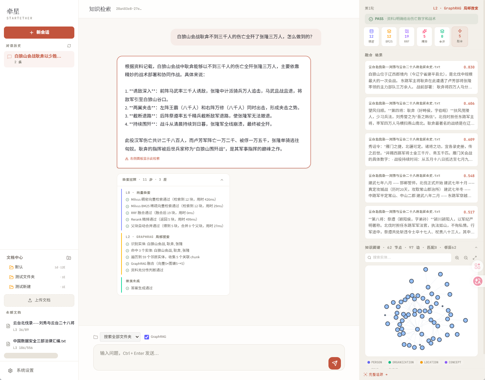

# 牵星 · StarTether

<div align="center">

**企业级知识引擎** · 多级检索路由 + GraphRAG + 知识图谱可视化

[](https://www.python.org/)
[](https://fastapi.tiangolo.com/)
[](https://react.dev/)
[](https://milvus.io/)
[](LICENSE)

</div>

---

## 核心特性

### 🔍 混合检索
- **Dense + BM25 双路召回** — Milvus 混合向量搜索 + RRF 融合
- **Rerank 重排序** — DashScope qwen3-rerank 精细排序
- **三级自动合并** — L1/L2/L3 层级 chunk，命中足够子块自动替换为父块

### 🧠 智能升级路由

```
用户提问 → RAG (L0) → 评级 → 不通过
              ↓ 通过         ↓
           直接回答    查询重写 (L1) → 仍失败
                                       ↓
                              GraphRAG Local Search (L2) → 仍失败
                                                              ↓
                                                     Global Search (L3)
```

- **L0 · 向量检索** — 最快，默认路径
- **L1 · 查询重写** — Step-Back + HyDE 双策略
- **L2 · 知识图谱遍历** — 实体匹配 → 图遍历 → chunk 召回
- **L3 · 社区摘要** — Leiden 社群检测 + LLM 摘要全局回答

### 🕸️ 知识图谱（GraphRAG）

- **实体/关系提取** — Microsoft GraphRAG 官方 prompt + Gleaning 循环
- **Leiden 社区检测** — 层级社区 + LLM 摘要生成
- **NetworkX 内存检索** — 零网络 IO，毫秒级图遍历
- **Neo4j 可视化** — 交互式图谱（vis-network），可选、挂了不影响检索

### 📂 文件夹隔离

- 层级文件夹，每个文件夹独立图谱
- 同一文件夹内文档实体自动跨文档关联

### ⚡ 实时流式

- 文档摄入 SSE 进度推送
- 检索步骤 SSE 实时可视化
- 回答 Token 级流式输出

---

## 界面预览

### AI 问答
<div align="center">
  
  <p><em>检索过程实时可视化，右侧面板展示 L0-L3 各阶段耗时与结果</em></p>
</div>

### 文档入库
<div align="center">
  
  <p><em>SSE 流式推送解析→分块→向量化→图谱提取全链路进度</em></p>
</div>

### 知识图谱
<div align="center">
  
  <p><em>Neo4j + vis-network 交互式图谱，支持实体搜索与关系溯源</em></p>
</div>

---

## 技术栈

| 层 | 技术 |
|---|------|
| **后端** | Python 3.12+ · FastAPI · Uvicorn |
| **前端** | React 19 · TypeScript · Vite · Tailwind CSS v4 |
| **向量库** | Milvus 2.5（Dense FLOAT_VECTOR + BM25 SPARSE_FLOAT_VECTOR） |
| **关系库** | PostgreSQL + pgvector |
| **图存储** | NetworkX（检索） + Neo4j（可视化） |
| **LLM** | DeepSeek（对话/评级/实体提取） · DashScope text-embedding-v4（嵌入） · qwen3-rerank（重排） |
| **实体嵌入** | paraphrase-multilingual-MiniLM-L12-v2（384 维本地推理） |
| **可观测性** | LangSmith 全链路追踪 |

---

## 快速开始

### 1. 环境要求

- Python 3.12+
- Node.js 20+
- PostgreSQL 15+（含 pgvector 扩展）
- Milvus 2.5+（需 SPARSE_FLOAT_VECTOR 支持）
- Neo4j 5（可选，仅可视化）

### 2. 安装依赖

```bash
# Python
uv sync

# 前端
cd frontend && npm install
```

### 3. 配置环境变量

```bash
cp .env.example .env
# 编辑 .env，填入 API 密钥和数据库连接信息
```

### 4. 初始化数据库

首次启动会自动建表（`db.py` 中的 `init_db()`），确保 PostgreSQL 已运行且 `rag_db` 库已创建。

### 5. 启动服务

```bash
# 后端（端口 8000）
uv run uvicorn main:app --reload

# 前端（端口 5173）
cd frontend && npm run dev
```

浏览器打开 `http://localhost:5173`。

### 6. Docker 基础设施（推荐）

```bash
# PostgreSQL + pgvector
docker run -d --name rag-postgres \
  -e POSTGRES_PASSWORD=postgres \
  -p 5432:5432 \
  pgvector/pgvector:pg16

# Milvus Standalone
docker run -d --name rag-milvus \
  -p 19530:19530 -p 9091:9091 \
  milvusdb/milvus:v2.5.14

# Neo4j（可选，图谱可视化）
docker run -d --name rag-neo4j \
  -e NEO4J_AUTH=neo4j/password \
  -p 7474:7474 -p 7687:7687 \
  neo4j:5
```

---

## 项目结构

```
RAG_new/
├── main.py                  # FastAPI 应用入口（25+ API 端点）
├── config.py                # 配置管理 + 运行时覆盖
├── db.py                    # PostgreSQL 连接 + DDL
├── schemas.py               # Pydantic 模型
│
├── retriever.py             # 多级检索路由
├── graph_retriever.py       # GraphRAG local/global search
├── entity_extractor.py      # 实体/关系提取管道
├── community_detector.py    # Leiden 社区检测 + LLM 摘要
├── graph_store.py           # NetworkX 图 CRUD + JSON 持久化
├── neo4j_store.py           # Neo4j 连接 + 子图查询
│
├── ingest.py                # 文档解析 + 三级分块 + Milvus 写入
├── milvus_store.py          # Milvus 集合管理 + 混合搜索
├── llm_service.py           # LLM 客户端 + prompt 构建
├── query_rewriter.py        # Step-Back / HyDE 查询重写
├── grader.py                # 上下文充分性评级
├── reranker.py              # qwen3-rerank 重排序
│
├── chat_memory.py           # 会话管理 + 消息持久化
├── memory_summarizer.py     # LLM 会话摘要 + 标题生成
├── folder_service.py        # 文件夹 CRUD
├── entity_embedder.py       # 实体相似度（MiniLM）
│
├── frontend/                # React 19 前端
│   └── src/
│       ├── pages/           # Chat · Documents · Settings · TraceView · DocDetail
│       ├── components/      # Layout · Sidebar · FolderTree · KnowledgeGraph · UploadModal
│       └── api.ts           # API 客户端 + 类型定义
│
├── data/                    # 运行时数据（graphs / community_reports）
├── pyproject.toml           # Python 项目配置
└── .env.example             # 环境变量模板
```

---

## API 端点

### 文档摄入
| 方法 | 路径 | 说明 |
|------|------|------|
| POST | `/ingest/stream` | SSE 流式上传文档 |
| POST | `/folders/{id}/ingest/stream` | 上传到指定文件夹 |

### 文档管理
| 方法 | 路径 | 说明 |
|------|------|------|
| GET | `/documents` | 列出文档 |
| DELETE | `/documents/{name}` | 删除文档 |
| GET | `/documents/{name}/graph` | 文档级图谱数据 |

### 聊天
| 方法 | 路径 | 说明 |
|------|------|------|
| POST | `/chat/stream` | SSE 流式 RAG 问答 |
| POST | `/chat` | 非流式问答 |

### 会话
| 方法 | 路径 | 说明 |
|------|------|------|
| GET | `/sessions` | 列出会话 |
| PUT/DELETE | `/sessions/{id}` | 重命名/删除会话 |

### 文件夹
| 方法 | 路径 | 说明 |
|------|------|------|
| GET/POST | `/folders` | 列出/创建文件夹 |
| GET | `/folders/tree` | 文件夹树 |
| PUT/DELETE | `/folders/{id}` | 重命名/删除文件夹 |
| GET | `/folders/{id}/graph` | 文件夹级图谱 |

### 设置
| 方法 | 路径 | 说明 |
|------|------|------|
| GET/PUT | `/api/settings` | 查看/修改运行时参数 |

---

## 配置参数

前端设置页可动态调整 15 个参数，部分即时生效：

| 参数 | 默认值 | 说明 |
|------|--------|------|
| `top_k` | 5 | 最终送给 LLM 的 chunk 数 |
| `graph_max_hops` | 2 | 图遍历邻居层级 |
| `entity_extraction_confidence_threshold` | 0.6 | 实体提取最低置信度 |
| `auto_merge_min_children` | 2 | 触发父块替换的最少子块数 |
| ... | ... | 更多见 `config.py` |

---

## License

MIT © StarTether
